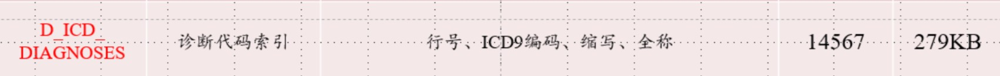
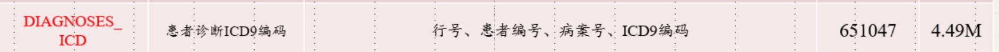
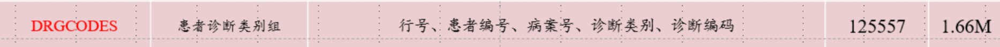
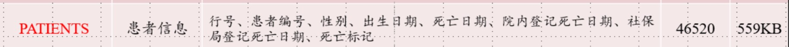

# ICU_AF_Prediction
# MIMIC-III Dataset
- [Official Website - MIMIC-III Clinical Database](https://physionet.org/content/mimiciii/1.4/)
- [Official Website - MIMIC-III Waveform Database](https://physionet.org/content/mimic3wdb/1.0/)
- [MIMIC-III Clinical数据集介绍](https://blog.csdn.net/qq_43787862/article/details/105028846)
- [MIMIC III  Clinical 数据集详细介绍](https://blog.csdn.net/weixin_44285445/article/details/109355391)
- [MIMIC-III 波型数据库说明](https://blog.csdn.net/weixin_44507594/article/details/115583569)
- 
## 主要研究使用: MIMIC-III Clinical Database
- `ADMISSIONS.csv` : 
    
- `D_ICD_DIAGNOSES.csv`
    
- `DIAGNOSES_ICD.csv`
    
- `DRGCODES.csv`
    
- `ICUSTAYS.csv`
    
- `PATIENTS.csv`
    
- `PRESCRIPTIONS.csv` : 患者用藥紀錄
---
## SUBJECT_ID, HDAM_ID, ICDSTAY_ID 架構
```yaml
SUBJECT_ID = A
    ├─ HADM_ID = 1001
    │    └─ ICUSTAY_ID = 5001, 5002
    ├─ HADM_ID = 1010
    │    └─ ICUSTAY_ID = 5100
    └─ HADM_ID = 1100
         └─ ……
```
- `SUBJECT_ID`:代表一位獨立病人（患者）
- `HADM_ID`: 該病人在醫院中一次完整住院過程 (Hospital Admission)
- `ICUSTAY_ID`: 每次住院中，可能又會有多次進出 ICU，所以 一個 HADM_ID 下可能有多筆 ICUSTAY_ID

# Preprocessing
## ICD9 - 427 
- 出現過的ICD9-427
    ```
    42731    12891
    42789     2453
    4271      1811
    4275      1361
    42732     1217
    42741      568
    42781      389
    4270       161
    42769       82
    42761       26
    4279        20
    4272        11
    42760        4
    42742        4
    ```
---
## 前處理邏輯問題
1. Prefix 427 的 ICD9 總共 14 種，是全部只採用 42731 (最多) 嗎?
2. 多次進入醫院的病患(多個 `HADM_ID` )需採取哪幾筆資料
    - 保留第一次入院紀錄
        - 延伸問題：那萬一第一次進入沒進 ICU ?
    - 保留最後一次入院紀錄
        - 延伸問題：那萬一最後一次進入沒進 ICU ?
    - 全數保留 or 保留所有有進入 ICU 的紀錄：即 1 筆 `SUBJECT_ID` 對應多個 `HADM_ID` 與 `IUCSTAY_ID`
        - 延伸問題：那病人的特徵如年齡，疾病等特徵該如何擷取? (Maybe有時間跨度，不同種類疾病併發等)
3. 若一個病人在住院期間多次進出 ICU： 即一個 `HADM_ID` 對應多個 `ICUSTAY_ID`該如何處理

---
Question for Codemon
嗨學長打擾了，我是碩一的宥廷，接與然學長實驗的學弟。
我現在在資料前處理的環節遇到一點問題，之前學長有說過你們處理的方式比較接近，所以想來詢問學長的意見。
主要是關於單一患者在多個重複狀況下的資料篩選：
1. 多次進入醫院的病患(多個 `HADM_ID` )需採取哪幾筆資料
    - 保留第一次入院紀錄
        - 延伸問題：那萬一第一次進入沒進 ICU ?
    - 保留最後一次入院紀錄
        - 延伸問題：那萬一最後一次進入沒進 ICU ?
    - 全數保留 or 保留所有有進入 ICU 的紀錄：即 1 筆 `SUBJECT_ID` 對應多個 `HADM_ID` 與 `IUCSTAY_ID`
        - 延伸問題：那病人的特徵如年齡，疾病等特徵該如何擷取? (Maybe有時間跨度，不同種類疾病併發等)
2. 若一個病人在住院期間多次進出 ICU： 即一個 `HADM_ID` 對應多個 `ICUSTAY_ID`該如何處理
以上學長若覺得兩個實驗差異比較大沒辦法參照的話，那傳統上大概會怎麼處理，因為好像多數paper 也不會寫到這麼詳細的程度。
如果學長比較忙的話不知道能不能提供資料清洗的code參考呢
---

### ECG 清理 Prompt:
```
You are an experienced medical data engineer specializing in ECG signal preprocessing and Python-based data pipelines.

Your task is to design a modular and robust **data cleaning pipeline** for ECG signal data stored in a NAS network drive under the  MIMIC-III Waveform database `match` folder. The environment is Windows 11, and Python 3.11.9 is available with full access to all packages (e.g., `pandas`, `numpy`, `wfdb`, etc.).

---

##  **Background and Current Stage**

The preliminary data cleaning stage has already been completed:
- Target population has been filtered to those with **ICD9_Code 42731 (AF)**.
- Only subjects with **ICUSTAY** records are included.
- Subjects have been split into:
  - **Survival Group**: Based on `HOSPITAL_EXPIRE_FLAG == 0`
  - **Mortality Group**: Based on `HOSPITAL_EXPIRE_FLAG == 1`

You are now tasked with **ECG signal data filtering** based on the following criteria:

---

##  **ECG Filtering Rules**

###  Survival Group
- Signal Condition: Must contain **Lead II or higher leads** continuously recorded for **more than 10 hours**.
- Time Constraint: The ECG recording must be **before the subject is discharged from ICU**.

### Mortality Group
- Signal Condition: Must contain **Lead II or higher leads** continuously recorded for **more than 10 hours**.
- Time Constraint:
  - The ECG must be recorded **prior to ICU death**.
  - **Exclude** any signals recorded **after death**.

---

##  Task Requirements

You must design and implement a Python pipeline that meets the following criteria:

### 1. **Modular Design**
- Each step of the data cleaning process (e.g., load metadata, filter by group, validate ECG duration, etc.) must be implemented as a **separate, reusable function or module**.
- This allows quick substitution or modification of any single rule without affecting others.

### 2. **Invalid Subject Marking**
- If a subject fails to meet the filtering criteria, log the following information:
  - `SUBJECT_ID`
  - Clear textual reason for failure (e.g., "ECG duration < 10 hrs", "No Lead II or higher", "ECG recorded after ICU death", etc.)
- Output this log in an accessible format (e.g., CSV or JSON) for easy rule debugging.

### 3. **Final Output**
- Produce a list of valid `SUBJECT_ID`s that **pass all rules** and are ready for downstream analysis.

---

##  Environment Constraints
- **OS**: Windows 11
- **match folder**: Network attached storage (NAS), mounted and accessible via standard file paths
- **Python**: 3.22.9
- **Packages**: All Python packages are allowed (you may use `wfdb`, `pandas`, `numpy`, `os`, `datetime`, etc.)

---

##  Final Output
A Python-based, modular pipeline with:
- Clean function signatures
- Clear rule-specific error logging
- Easy-to-extend filtering logic

If any part of the task or assumptions is unclear, ask for clarification before proceeding. Do not invent or assume unspecified logic.
---
reply in traditional Chinese
```

# Issues
- 如果用 ECG 紀錄的最後一筆去抓有可能沒有對應的 ICU 紀錄
    - Update 應該用最後一筆 ICUSTAY 紀錄去抓有沒有對應的 ECG MATCH Record
- 有可能